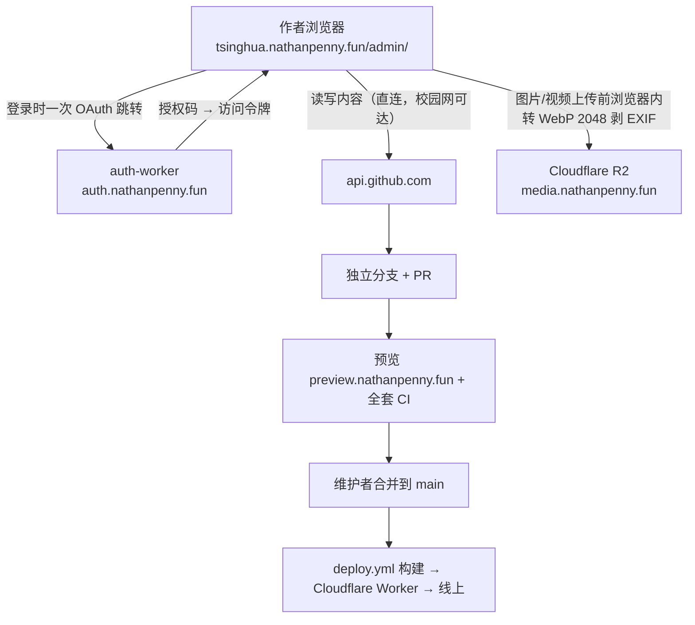

# 内容编辑方案：决策记录

> 状态：已落地，2026-10-03 复核
> **本文回答**：站内内容后台最后决定了什么、否掉了哪些备选、代价是什么、还剩什么没做。
> **不回答**：部署/开通步骤 → `HANDOVER.md` §9 / `auth-worker/README.md`；日常命令 → `README.md`。

---

## 1. 拍板结论（2026-09-30）

| 决定 | 内容 | 关键理由 |
| --- | --- | --- |
| **后台形态** | A 方案：Sveltia CMS，静态页在 `public/admin/`，挂在 `/admin/` | 纯前端 SPA，零后端零新资源；Git 原生，复用现有 PR + CI |
| **媒体存放** | **Cloudflare R2**（桶 `tsinghua-guide-media`，公开域名 `media.nathanpenny.fun`），不进 Git | 仓库永远不因图片变重；`uploads/` 体积上限问题一次性消失 |
| **登录方式** | **GitHub OAuth**，经自建中转 `auth-worker/`（`auth.nathanpenny.fun`，内联 MIT 的 `sveltia/sveltia-cms-auth`，13KB） | 提案时推荐 PAT，拍板改成「可以开代理，令牌太麻烦」；中转只做「授权码 → 访问令牌」交换 |
| **备用入口** | `auth_methods: [oauth, token]`，令牌保留 | 中转挂掉时仍能进后台；想彻底去掉改成 `[oauth]` |
| **范围外** | 只有登录那一步需要代理（授权页在 `github.com`）；授权后全部走 `api.github.com`，校园网内完成 | 衡量过的代价：多一个 Worker、仅登录时需代理 |

一个不会 Git 的作者，完成一次改动的路径：

> 打开 `https://tsinghua.nathanpenny.fun/admin/` → 点一次 **Sign in with GitHub** → 选文章 → 改文字 → 拖图（浏览器内压成 WebP 存 R2）→ 写一行 `::bilibili[BV号]` → 保存 → PR → 预览 + CI → 合并上线。

## 2. 为什么不是别的方案

| 备选 | 一句话否决理由 |
| --- | --- |
| **B. 自研 `/studio/` 编辑器** | 能把本站 schema 做得最贴，但它是**要长期维护的第二套软件**；只有 A 实测被证伪才回头考虑。 |
| **C. 飞书/Notion 当内容源** | 页面构建从此依赖第三方 API 和文档结构；飞书图片是带防盗链/有效期的 CDN 链接，失效后历史文章里的图全变空。 |
| **D. R2/D1 自建后端 CMS** | 为几个人的编辑便利引入运行时后端 + 长期运维，打破「零隐藏资源」架构承诺（HANDOVER.md §0：没有任何 KV / D1 / Durable Object），收益不匹配。 |

## 3. 数据流

`publish_mode: editorial_workflow`：**每次保存开一个 PR，不直推 main** —— 后台也存在审稿，这是红线不被绕过的关键开关。

## 4. 与原提案的偏差（都是实测后改的）

| 偏差 | 原因 | 证据位置 |
| --- | --- | --- |
| **1. 视频语法糖用 Sätteri 插件，不是 remark 插件** | Astro 7 默认处理器是 Sätteri，`markdown.remarkPlugins` 要先装 `@astrojs/markdown-remark` 并把全站换回 unified；为一个语法糖换渲染器不划算。改用 Sätteri 的 `mdastPlugins`（Starlight 的 `:::tip` 同样接法），参数与 Astro 默认值一致，渲染行为不变。 | `src/utils/media-embed.mjs`；`node_modules/astro/dist/core/config/schemas/base.js:202` |
| **2. 媒体库直接上 R2，没有先用 `public/uploads`** | 拍板结论。仓库永不因图片变重，代价见 §6 与 `HANDOVER.md` §9.3。 | `public/admin/config.yml:75-89` |
| **3. `.mdx` 单独成集合** | 官方明确「一个集合只列出一种扩展名」，而站上 10 个 `.mdx` 里有 JSX 组件；拆成「文章（.md）」与「含组件页面（.mdx）」，后者单独写风险提示。 | `public/admin/config.yml` 的 `*-mdx` 集合；`HANDOVER.md` §9.6 第 3 条 |
| **4. 新增提案里没预料到的守卫：`check:media:dist`** | 实测：**Astro 内容加载器出错时 `npm run build` 仍返回 0，且那一页正文整个变空** ——「构建成功」完全不等于「内容都在」。于是加一条：数产物里的视频容器与源码里的语法糖是否一致。 | `scripts/check-media.mjs` 文件头；`HANDOVER.md` §9.6 第 1 条（标注「必需，不是锦上添花」） |
| **5. 新增「无头 Chrome 打开一次后台」的验证手段，并修掉三个静默失效** | 把配置丢给真实 CMS 跑才发现：`commit_messages` 写在顶层（应在 `backend` 下）、`slug.editable/pattern/hint` 写在顶层（应在集合级）、`automatic_deployments` 已被官方标为过时 —— 三者 CMS 只打印 warning 然后**静默忽略**。对应措施：`check:admin` 用官方 JSON Schema 校验整份配置，并要求后台页面锁定版本与 `package.json` 依赖版本一致（schema 与真实运行的 CMS 必须同源）。 | `scripts/check-admin.mjs`；`HANDOVER.md` §9.6 第 8、10 条 |
| **6. 登录方式从令牌改成 GitHub OAuth** | 拍板：可以开代理。代价是多一个 Worker，且登录那一步需要代理；授权后拿到长效令牌，之后读写全在校园网内。`auth_scope` 只接受 `repo`/`public_repo`（不能写 scope 列表），已按公开仓库收窄成 `public_repo`。 | `public/admin/config.yml:23,27,31`；`HANDOVER.md` §9.2、§9.6 第 12 条 |

## 5. 还没做的

| 项 | 状态 | 复核证据（2026-10-03） |
| --- | --- | --- |
| **GitHub OAuth App 两个密钥** | ✅ 已完成 | `npx wrangler secret list --config auth-worker/wrangler.jsonc` 能看到 `GITHUB_CLIENT_ID` / `GITHUB_CLIENT_SECRET`；`https://auth.nathanpenny.fun/auth` 返回正常登录页，不再是 `MISCONFIGURED_CLIENT` |
| **R2 API 令牌（`access_key_id`）** | ✅ 已完成 | `npm run r2:setup -- --check` 五项全绿（桶、公开域名、CORS、`public_url`、R2 API 令牌）；Secret Access Key 不进任何文件，编辑者首次用媒体库时在浏览器输入一次 |
| **校园网里复测 unpkg 可达性** | ⬜ **唯一还开着的** | 不通就跑 `npm run admin:vendor` 把编辑器脚本放进仓库。**确证：`public/admin/vendor/` 目前不存在**，说明兜底还没启用过 —— 现在「后台能不能自己加载编辑器」依赖 unpkg 可达，值得找一个校园网环境点一次 `/admin/`。 |

## 6. 明确不做 + 产品级取舍

| 项 | 结论 | 一句话理由 |
| --- | --- | --- |
| **`src/data/links.ts` / `resources.ts`** | 不做 | 链接和资料仍是代码；要做就另开一期 `data` 集合，不和本次混在一起。 |
| **图片放 `src/assets/`（Astro 优化图）** | 不做 | Sveltia 的 `public_folder` 不支持相对路径，而 `src/assets` 方案恰恰要求 `../../../assets/…`；两者不兼容，且手动算层级写错会直接构建失败（`[ImageNotFound]`）。 |
| **构建期重写图片路径（remark 插件）** | 不做 | 收益是拿到 srcset/AVIF，代价是多一类会静默失效的机制；本站风格偏保守，等真有流量压力再上。 |
| **`check-media` 与现有检查脚本的关系** | 补位 | `check-assets.mjs` 只管分享卡片/favicon；`check-media.mjs` 补语法糖写法、外链图床、`http://`、空 alt、产物容器数比对。 |
| **自托管短视频（`::video[地址]`）** | 已可用 | 适合无声短录屏（放 R2，不是仓库）；`max_file_size` 从仓库时代的 1MB 放宽到 30MB 是一次显式决策，不是默认行为。 |
| **mp4 进 Git / YouTube / Cloudflare Stream** | 不做 | 仓库会永久膨胀且 Sveltia 的 GitHub 后端不支持 LFS；YouTube 境内打不开，违反「校园网可用」底线；Stream 付费且收益不匹配。 |
| **查校规则（`check-content.ts`）** | 一条不放宽 | 后台要做到「产出的内容天然合规」，而不是把校验放松。 |
| **手机 App / 小程序** | 不做 | 后台是响应式网页，手机浏览器够用。 |

## 7. 风险与对策

| 风险 | 概率 | 对策 |
| --- | --- | --- |
| **`unpkg.com` 校园网不可达** | 中 | 开发机实测可达（2.1MB / gzip 663KB）；校园网必须复测，不通就跑 `npm run admin:vendor` 把 bundle 放进 `public/admin/vendor/`（本地优先、CDN 兜底）。 |
| **Sveltia 仍是 beta，版本变动破坏配置** | 中 | CDN 地址与 npm 依赖都锁死版本号；`config.yml` 用官方 schema 校验；版本号写进 `HANDOVER.md`。 |
| **Markdown 编辑器重排 `:::` 容器或裸 HTML** | 中 | 默认用原文模式而非富文本；`check-content.ts` 已有结构校验，`check-media` 再补一条「容器语法未被破坏」。 |
| **作者填中文 slug，CI 报错却以为「后台坏了」** | 高 | slug 作为必填字段 + 示例 + 中文提示；CI 报错文案保持现有的人话风格。 |
| **内容红线被绕过（后台太方便）** | 低 | 编辑工作流强制走 PR 审阅；红线文案写进集合说明；媒体库上传前提示不得传内部系统截图、成绩单。 |
| **OAuth 中转挂掉 / 密钥泄漏** | 低 | 保留令牌登录作备用；密钥只在 Worker secret 里，`config.yml` 不含任何密钥；三处地址（CMS `base_url` / Worker routes / OAuth App callback）一致性有 `check:admin` 兜底。 |
| **媒介域名白名单两处漂移** | 低 | `config.yml` 的 `public_url` 与 `scripts/check-media.mjs` 的 `allowedHosts` 必须同时改。 |

## 8. 复核用的技术依据

展开：每条结论的出处（2026-09-30 实测，2026-10-03 复核）

| 结论 | 依据 |
| --- | --- |
| 校园网 `github.com` 网页端不通、`api.github.com` 通 | `README.md` §一（校园网说明） |
| 本站是纯静态、无 KV/D1 | `wrangler.jsonc`、`HANDOVER.md` §0 |
| 后台覆盖 12 个目录集合 + 1 个单文件集合，共 47 个内容文件 | `npm run check:admin`（每次 CI 复核这个数字） |
| 推送 main 自动部署；PR 有独立预览域名 | `.github/workflows/deploy.yml`、`preview.yml` |
| 正文相对路径图片会被 Astro 优化成 WebP 并补 `width/height/lazy` | 实测（探针产物 `/_astro/_probe.*.webp`）；路径算错则 `[ImageNotFound]` 构建失败 |
| 内容加载器出错时构建返回 0 且那页正文变空 | 实测（`[starlight-docs-loader] Error rendering …`，`build exit=0`） |
| 一个集合只列一种扩展名 | <https://sveltiacms.app/en/docs/collections/entries/formats.md> |
| Sveltia 支持 R2 外置媒体库、Secret Access Key 由编辑者输入 | <https://sveltiacms.app/en/docs/media/cloudflare-r2.md> |
| bundle 2.1MB / gzip 663KB；R2 用途与 30MB 上限 | 实测下载 unpkg 产物；`public/admin/config.yml:90-96` |

### 改这个功能之前请先读

- `HANDOVER.md` §9（站内后台）—— 开通步骤、令牌怎么发、14 条踩坑记录。
- `scripts/check-admin.mjs`、`scripts/check-media.mjs` 的文件头注释 —— 「不许静默失效」的具体化。
- `public/admin/config.yml` 顶部注释 —— 哪些值可以公开、哪些绝不能进仓库。
