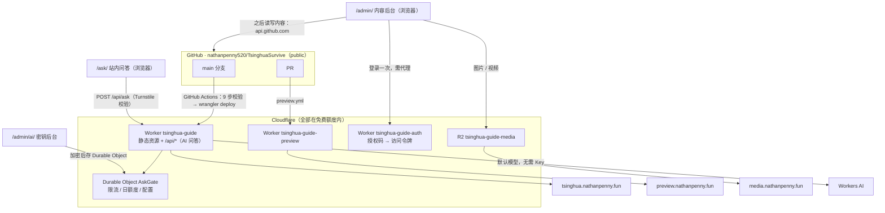

# 交接文档

> 这份文档假设读者**对这个项目一无所知**，目标是 10 分钟内接手全部运维。
> **本文回答**：资源在哪、怎么部署、后台怎么运作、坏了怎么查、性能基线是多少。
> **不回答**：日常改内容 → [README.md](./README.md)｜内容还缺什么 → [OUTLINE.md](./OUTLINE.md)｜设计史 → [REFERENCE-NOTES.md](./REFERENCE-NOTES.md)
>
> 最后更新 **2026-10-03**（全量复核：克隆健康、检查脚本、性能基线、云上资源状态 —— 证据见 REFERENCE-NOTES.md 第十节）

---

## 0. 一页速览



| 组件 | 名字 | 状态（2026-10-03） |
| --- | --- | --- |
| 正式站 Worker | `tsinghua-guide` → `tsinghua.nathanpenny.fun` | ✅ 线上 200 / 0.65 s |
| PR 预览 Worker | `tsinghua-guide-preview` → `preview.nathanpenny.fun` | ✅ 线上 200 |
| OAuth 中转 Worker | `tsinghua-guide-auth` → `auth.nathanpenny.fun` | ✅ 已部署且两个 secret 都已配好 |
| R2 桶 | `tsinghua-guide-media` → `media.nathanpenny.fun` | ✅ 桶 / 域名 / CORS / access_key_id 全绿 |
| KV / D1 | —— | 没有，一个都不用 |
| Durable Object | `AskGate`（正式站与预览站各一个） | ✅ 随 `wrangler deploy` 的迁移创建，见第 10 节 |
| 内容后台 | `/admin/`（Sveltia CMS，纯静态） | ✅ 随站点部署，见第 9 节 |

---

## 1. 一句话现状

经验分享站：Markdown 写在 GitHub，构建产物托管在 Cloudflare Workers，主域名 <https://tsinghua.nathanpenny.fun>。
**2026-10-05 起多了一个后端**：`/api/*` 提供站内 AI 问答（检索 + 生成 + 人机校验）。页面、图片、
Pagefind 索引仍然是纯静态直出——`run_worker_first` 只把 `/api/*` 交给 Worker，静态请求不进 Worker，
所以「改了 Markdown → 提交 → 自动部署」这条主线没有变。
**没有用户系统、没有数据库**；唯一的持久化是一个 Durable Object（限流计数 + 加密后的第三方 API Key）。

---

## 2. 资源清单

接手时最先要的就是这串 ID，**全部已核对**。

| 项目 | 值 |
| --- | --- |
| 主域名 | `https://tsinghua.nathanpenny.fun` |
| Cloudflare 账号 | `Nathanpenny520@gmail.com's Account` |
| Account ID | `aa23021279f1ffd6901d7093879554f3` |
| Zone | `nathanpenny.fun`（status: active） |
| Zone ID | `068decbde572025a27b25b97080e4355` |
| Zone 的 NS | `anton.ns.cloudflare.com`、`mona.ns.cloudflare.com` |
| Worker（正式） | `tsinghua-guide`｜Custom Domain ID `4185b3075488e7e75699ac5e82db5500b545e3df`｜证书 ID `21a021b9-dcc7-4d03-98ee-2e46106ccb78` |
| Worker（预览） | `tsinghua-guide-preview` → `https://preview.nathanpenny.fun` |
| Worker（OAuth 中转） | `tsinghua-guide-auth` → `https://auth.nathanpenny.fun`，代码在 `auth-worker/`，**不随主站 CI 部署** |
| R2 桶 | `tsinghua-guide-media` → `https://media.nathanpenny.fun` |
| GitHub 仓库 | <https://github.com/nathanpenny520/TsinghuaSurvive>（public，`main`） |
| 本地路径 | `TsinghuaSurvive/Tsinghua-guide/` |

站点能力一览 —— 除了最后一行，**其余全部在构建期完成**：

| 能力 | 实现位置 |
| --- | --- |
| 全文搜索（中文分词） | Starlight 内置 Pagefind（构建时生成静态索引） |
| 按阶段 / 按标签浏览 | `src/pages/stages/`、`src/pages/tags/`，从 frontmatter 自动聚合 |
| 时效看门狗 | `src/components/Banner.astro`（阈值读 `content-policy.json`） |
| JSON-LD 结构化数据 | `src/components/Head.astro` |
| 分享卡片图 | `public/og.png` + `public/og/*.png`，由 `scripts/generate-og.mjs` 生成 |
| RSS / sitemap / robots | `src/pages/rss.xml.ts`、`@astrojs/sitemap`、`public/robots.txt` |
| 内容后台 + 视频语法糖 | `public/admin/`、`src/utils/media-embed.mjs`（见第 9 节） |
| **站内 AI 问答** | `src/worker/`（运行时，`/api/*`）+ `src/components/AskBox.astro`（见第 10 节） |

仓库 Secrets（**两个都已配好，CI 已实测跑通**）：`CLOUDFLARE_ACCOUNT_ID` ✅、`CLOUDFLARE_API_TOKEN` ✅（权限最小集合见第 5 节）。

**Worker 侧的 Secret（不属于仓库 Secrets，用 `wrangler secret put` 写入，见第 10.2 节）**：

| 名字 | 用途 | 缺了会怎样 |
| --- | --- | --- |
| `TURNSTILE_SECRET_KEY` | 人机校验的 siteverify | `/api/ask` 一律 503（fail-closed） |
| `ADMIN_TOKEN` | `/admin/ai/` 的口令 | 后台接口 503，密钥改不了 |
| `CONFIG_ENC_KEY` | 加密后台填的第三方 API Key | 后台存不了 Key（仍可用 Workers AI） |
CI 验证记录：`workflow_dispatch` 运行 34 s 全绿，Cloudflare 侧生成新版本 `2166042b-d87d-4c0a-9292-b5a95e0602dd`（02:51:52Z），站点 HTTP 200。

> ⚠️ token 被吊销或过期时，工作流**不会红叉**：凭证守卫分支会给出 `::warning::` 注解并只构建不部署。

---

## 3. 架构与决策理由

| 部分 | 选型 | 为什么不是别的 |
| --- | --- | --- |
| 框架 | Astro 7，`output: 'static'` | 默认零 JS；VitePress 加自定义排版要写 Vue，Docusaurus / Next.js 对这个体量是纯负担 |
| 主题 | Starlight | 侧边导航、目录、深色模式、搜索、i18n 全部内置 |
| 搜索 | Pagefind（Starlight 内置） | 构建时生成静态索引，不需要服务端 |
| 托管 | Cloudflare Workers：静态资源 + 一个 `/api/*` 入口 | 页面仍然是纯静态直出（`run_worker_first` 只管 `/api/*`），静态请求不计费、无冷启动；**加后端只加在问答接口上**，不牺牲站点其余的零运行时特性 |
| 内容 | Markdown / MDX + zod 强校验 | frontmatter 写错**构建直接失败并指出文件**，不会静默生成坏页面 |

**决策一：必须用自定义域名。** 实测 `tsinghua-guide.nathanpenny520.workers.dev` 在校园网被 DNS 污染（解析到美国 IP `208.101.21.43` 后超时）；绑定自定义域名后 **HTTP 200、TLS 0.17 s、整页 0.5–0.9 s**。所以 `wrangler.jsonc` 里写的是
`"routes": [{ "pattern": "tsinghua.nathanpenny.fun", "custom_domain": true }]`。
副作用：声明 `routes` 后 Wrangler **默认关闭 workers.dev 入口与 Preview URL** —— 有意的，避免同一站点两个域名；海外调试可临时加 `"workers_dev": true`。

**决策二：仓库根 = 站点根。** 别人 clone 后 `npm install && npm run dev` 就能跑。**没有**把父目录 `TsinghuaSurvive/` 当仓库根 —— 那样会把 `Tsinghua-agent/`（含 `.env`、爬虫逻辑、自己的远程仓库）一起暴露到公开仓库。

---

## 4. 日常操作

### 改一篇文章

```bash
npm run dev            # http://localhost:4321，改 Markdown 自动热更新
npm run check:all      # 提 PR 前跑（类型 + 内容 + 后台 + 媒体）
git add -A && git commit -m "docs: 更新选课时间线" && git push
```

> ⚠️ **正文里要写 JS 时必须用 `.mdx`，而且顶层声明要写 `export const`**（2026-09-30 实测）：
> 裸 `const` 时 `astro check` 报 0 errors，但 `npm run build` 直接失败 —— **`check:all` 抓不到，只有真跑一次 build 才暴露**。
> 报错文案：对象字面量 → `Could not parse expression with oxc: Expected ',' or ')' but found ':'`；普通语句 → `Unexpected statement in code: only import/exports are supported`。

### 提交前的自动检查

| 命令 | 关键点 |
| --- | --- |
| `npm run check:all` | 类型 + 内容 + 后台 + 媒体 |
| `npm run check:content` / `:strict` | 内容检查；`strict` 连债务警告也当错误（发布前用） |
| `npm run verify` | 上面全部 + 构建 + JSON-LD + 资源 + 订阅 + 产物比对 —— **一条命令跑完，提 PR 前跑这个** |

`check-content.ts` 会抓**构建本身抓不到**的问题：

| 级别 | 检查项 |
| --- | --- |
| **错误**（阻断部署） | 站内链接指向不存在的页面（带文件:行号）、文件名不是 ASCII slug、`reviewedAt` 写在未来、同目录 `sidebar.order` 冲突、`links.ts` 重名或非法网址、资料有提取码却没链接、课程索引引用了未定义的资料库或拼不出链接 |
| **警告**（只提示） | 作者还是占位符、`status: draft` 数量、链接没有 `reviewedAt` 或超过 12 个月未确认、链接实测结果过期或有链接打不开、文章超过 6 个月未核对 |

CI 另外跑：`courses:check`（构建前）、构建后的 `check:jsonld` / `check:assets` / `check:markup` / `check:feeds` / `check:media:dist`。
**错误级检测都做过注入测试验证会真的触发**，不是写了没用。

### 实测链接是否还能打开

```bash
npm run check:links                    # 逐个请求，写 src/data/link-status.json
npm run check:links -- --fail          # 有链接打不开时以非 0 退出
LINK_CHECK_NETWORK='清华校园网（无线，DNS 166.111.8.28）' npm run check:links   # 标测点（重要）
```

⚠️ 需要联网，所以**不进 CI 必跑步骤**（某个学校系统抽风会误报）。建议每次内容批量更新后手动跑一次并提交 `link-status.json`。
页面上每条链接有两个独立角标：**实测**（机器测「网址活着」，不证明入口还是干那件事）与**人工核对**（`reviewedAt`，有人点开确认过）。

### 验证前端交互（改了 `/courses/` 或链接页之后）

```bash
npm run build
npx astro preview --port 4321 &
npm run check:e2e -- --base http://localhost:4321
```

> ⚠️ **`--base` 写 `localhost`，别写 `127.0.0.1`**（2026-10-03 实测）：`astro preview` 在 macOS 上只绑 IPv6 回环（`lsof` 显示 `TCP [::1]:4321`），写 `127.0.0.1` 会连不上，表现是 e2e **全 ✖、卡片 0 张** —— 很容易误判成「交互工具坏了」。用 `python3 -m http.server`（绑 127.0.0.1）时两种写法都行。

它会用无头 Chrome 打开 `/courses/` 与 `/guides/links/`，真的输入搜索词、点筛选按钮，断言「卡片数会变、清除筛选能还原、无结果时给空状态」。
找不到 Chrome 时跳过而不是报错，所以也没进 CI（CI 装浏览器成本太高），属于本地改动后的自查手段。

<details>
<summary>脚本里那三个 Chrome 启动参数是必需的（三个问题都表现为「脚本挂住、不说原因」）</summary>

| 参数 | 不写会怎样 |
| --- | --- |
| `--remote-allow-origins=*` | Chrome 111 起 DevTools 的 WebSocket 会校验 Origin，Node 客户端不放行就被直接拒掉 |
| `--no-sandbox` | 受限环境里 Chrome 自己的沙箱起不来，表现为渲染进程立刻崩、`evaluate` 永不返回 |
| `--disable-dev-shm-usage` | 容器里 `/dev/shm` 太小会让渲染进程崩 |

关于「JS 插入的元素有没有吃到样式」的断言：**无样式的 `input` 在 Chrome 里算出来是 `2px inset`**，
所以「边框不是 `solid` 就判失败」这条断言真的会失败，不是摆设 —— 这一点是实测过的，不是推理。

</details>

### 重新生成课程资料索引

```bash
npm run courses            # 扫描本地资料库 → src/data/course-index.json
npm run courses:check      # 只校验现有 JSON 与本地资料库是否一致（CI 用）
```

资料库 2026-10-05 从 `reference/` 整理迁移到了 `materials/`（分类与来源见 `materials/README.md`）：
6 个第三方库合计约 13 GB（原为 24 GB，已删掉各库共约 11.3 GB 的 `.git`），已写进 `.gitignore`，不要提交。
`scripts/build-course-index.mjs` 对每个库都按「`materials/` 优先、`reference/` 兜底」解析路径，两处都能扫。
两处都没有时脚本会跳过对应资料库并打提示，`/courses/` 用已提交的 `course-index.json` 照常渲染。

### 链接核对：先脚本、后人工

```bash
npm run verify:links              # 抓页面比对标题/关键词 → .review/link-verification.json
npm run verify:links -- --apply   # ok 的条目写回 reviewedAt + verifiedBy: 'auto'

npm run review:links -- --open    # 人工核对清单（离线 HTML，localStorage 存进度）
npm run review:links:apply -- ~/Downloads/link-review.json          # 只看 diff
npm run review:links:apply -- ~/Downloads/link-review.json --write  # 写回 links.ts
npm run check:content && npm run build
```

- 脚本判断依据三类：标题命中期望词、正文命中、落到同机构认证端点/自有域名；关键词表在 `scripts/verify-links.ts` 的 `EXPECT_BY_HOST`（**新增链接时要补一行**）。
- 老系统是 GBK 编码、登录页没有标题 —— 这两类**不是故障**，脚本已处理。
- 人工核对导出的规则：✓ 写 `reviewedAt`；✗ 且填了新地址则替换 `url` 并记日期；✗ 只写备注的进 `.review/link-issues.md`，**不自动改**。
- `.review/` 已在 `.gitignore` 里，是工作目录。

### 加一个校内链接 / 加一份资料

- `src/data/links.ts`：加记录（含 `reach` 与 `origin`）。**网址活着是机器测的，入口有没有写错只有人能判断** —— 填上 `reviewedAt` + `verifiedBy` 才会消掉「人工核对：待补」。
- `src/data/resources.ts`：`url` 留空或写 `'TODO'` 时页面显示「待补充」，不会渲染死链。**文件本体不要进仓库。**

### 站内互动工具（没有后端）

| 工具 | 文件 | localStorage 键名 |
| --- | --- | --- |
| 报到清单（可勾选） | `Checklist.astro` → `/freshman/arrival-checklist/` | `tsinghua-guide-checklist:<id>` |
| 学分缺口拆解表 | `CreditPlanner.astro` → `/academics/credit-planner/` | `tsinghua-guide-credit-planner-v1` |
| 选课决策工作台 | `SelectionWorkbench.astro` → `/academics/course-decision/` | `tsinghua-guide-selection-workbench-v1` |

数据只存在读者自己的浏览器里，**不采集、不上传**。改动后务必跑 `npm run check:e2e` —— 这几个组件的关键路径是「点一下会不会真算」。

> ⚠️ **写这类组件必须用 `<style is:global>` + 类名前缀**（`CreditPlanner` 踩过，2026-09-30 修掉）。
> Astro 的 `<style>` 默认是作用域样式，选择器编译成 `.foo:where(.astro-xxxx) input:where(.astro-xxxx)`，
> 而 `astro-xxxx` 只加在**模板元素**上 —— JS 用 `innerHTML` 插进去的元素没有这个类，那部分样式整片失效
> （输入框退回白底黑字、分隔线消失），**没有任何报错或构建警告**。
> `Checklist` 不受影响（整块 DOM 由模板渲染）；`CourseExplorer` / `SelectionWorkbench` 一开始就写对了。
> `e2e-smoke.mjs` 已加断言：点「加一行」后量新输入框的 `computedStyle`，边框不是 `solid` 即失败 —— **新组件照抄这条断言**。

### 重新生成分享卡片图

```bash
npm run og             # 用 sharp 渲染，只要 npm install 过就能跑
```

文案在 `scripts/generate-og.mjs` 顶部。**中文标题改动后一定要重新生成**，否则分享出去的卡片还是旧标题。

### 部署 / 回滚 / 紧急下线

```bash
npm run deploy         # = npm run build && wrangler deploy（平时不用跑，推 main 会自动部署）
npm run deploy:dry     # 只验证，不上传
npx wrangler versions list && npx wrangler rollback <VERSION_ID>   # 回滚
npx wrangler delete    # 紧急下线（自定义域名的 DNS 记录会一起清理）
```

---

## 5. CI 的 API Token

**状态：已配好并实测通过。** 本节留给「token 过期 / 被吊销 / 换账号」时用。

创建这一步**必须人工做** —— wrangler 的 OAuth 凭证没有管理 API Token 的权限（调用返回 `9109 Unauthorized`），无法脚本化。

1. <https://dash.cloudflare.com/profile/api-tokens> → **Create Token** → **Custom token**
2. 权限按下表配（这是能跑通部署的**最小集合**）：

| 范围 | 权限 | 为什么需要 |
| --- | --- | --- |
| Account | **Workers Scripts** · Edit | 上传脚本与静态资源 |
| Account | **Account Settings** · Read | wrangler 解析账号 |
| Zone · `nathanpenny.fun` | **Workers Routes** · Edit | 部署时核对自定义域名绑定 |
| Zone · `nathanpenny.fun` | **Zone** · Read | 同上，需要先列出已有域名 |

3. Account Resources 选你的账号；Zone Resources **只选 `nathanpenny.fun`**（不要给 All zones）。
4. 创建后立刻复制 token 写入仓库 Secret：`gh secret set CLOUDFLARE_API_TOKEN --repo nathanpenny520/TsinghuaSurvive`（或网页 Settings → Secrets → Actions）。
5. 验证：`gh workflow run deploy.yml --repo nathanpenny520/TsinghuaSurvive`，然后 `gh run watch`。

---

## 6. 故障排查

| 症状 | 原因与处理 |
| --- | --- |
| `EPERM ... ~/.npm/_logs` | 沙箱不允许写用户目录。`export npm_config_cache="$PWD/.npm-cache"` |
| `EPERM ... .wrangler/logs` | 同上，`export WRANGLER_LOG_PATH="$PWD/.wrangler-logs"` |
| 域名解析 NXDOMAIN | **先别急着改配置**。清华校园网**透明劫持 53 端口 DNS**：问 8.8.8.8 / 223.5.5.5 / 119.29.29.29 拿到的都是校内解析器的答案，看起来像「公共 DNS 全挂了」。用 DoH（443 端口）绕开验证：`curl "https://dns.alidns.com/resolve?name=tsinghua.nathanpenny.fun&type=A"`；铁证：`dig +short TXT o-o.myaddr.l.google.com @8.8.8.8` 返回校内地址就是被劫持。真正原因通常只是校内解析器缓存了建记录之前的否定结果（SOA minimum=1800，约 30 分钟过期） |
| 站点打不开但 Cloudflare 显示已部署 | 先分清 DNS 还是部署：`curl --resolve tsinghua.nathanpenny.fun:443:172.67.207.247 https://tsinghua.nathanpenny.fun/` 绕过 DNS 直连 |
| 搜索搜不到中文 | Pagefind 支持中文分词但**不做词干化**：「选课」与「选课规则」不互相命中。搜 2–3 字短词，靠 tags 补足 |
| **github.com 网页端打不开** | 校园网实测（2026-09-30 超时 / 2026-10-03 复测 200，**会变**）：`git push` / `git clone`（SSH，22 与 `ssh.github.com:443`）、`api.github.com`、`gh` CLI 全部正常，**只有网页端不行**。所以走「本地改 + `git push`」或站内后台，别指望点网页上的「编辑此页」——那些链接没写错 |
| 构建报 frontmatter 错误 | **设计如此**。按报错指出的文件修正字段，字段定义见 `src/content.config.ts` |
| 部署刚完成时个别页面 404 | **部署传播竞态**，几秒后自恢复（实测遇到过一次 `/freshman/dorm-and-network/`）。等 10 秒再请求一次，仍 404 才是真问题 |
| 中文标签/阶段页返回 307 | **正常**。Cloudflare 把原始 UTF-8 路径（`/tags/选课/`）307 规范化到百分号编码形式，浏览器自动跟随，最终 200 |
| 页面顶部橙色过期提醒 | **看门狗在工作**：`reviewedAt` 超过 `content-policy.json` 的 `staleAfterMonths`（默认 6 个月）。重新核对后更新 `reviewedAt` |
| 页面顶部红色过期警告 | 作者把 `status` 设成了 `outdated`。内容修好后改成 `stable` |
| 分享卡片还是旧标题 | `public/og.png` 是**静态文件**，改标题后要跑 `npm run og` |
| 内容检查报「站内链接指向不存在的页面」 | 改文件名或移动文章后没同步引用。报错带文件:行号；中文标签链接（`/tags/选课/`）与编码形式都已识别，不会误报 |
| 预览链接 404 或 PR 上没有预览评论 | 先确认 PR 是不是来自 **fork**（fork PR 拿不到 Secrets，设计如此）；再看 `wrangler.preview.jsonc` 的预览域名是否创建成功 |
| 想删掉预览环境 | `npx wrangler delete --config wrangler.preview.jsonc`，并删除 `.github/workflows/preview.yml` |

---

## 7. 内容缺口与红线

**完整缺口清单在 [OUTLINE.md](./OUTLINE.md)**（那里是唯一快照，本文不重复）。运维视角只记三件仍然欠着的事：

| 还欠着 | 现状（2026-10-03 复核） |
| --- | --- |
| 署名 | 后台覆盖的 47 个内容文件里还有 **44 条**没署名（占位符或空），已有 5 篇写了真实署名 |
| 五篇骨架的亲历者 | 保研 / 出国 / 考研 / 本科生科研 / 读文献 —— 这几篇**不能由不了解当年政策的人代写**，写错时间线会真耽误别人一年 |
| 各院系的制度事实 | 选课轮次、退课规则、学分上限、考核比例：一律等当年通知，现在全是「以官方为准」 |

**绝对不能写进站点的内容**（详见站内《免责声明与内容边界》）：内部系统数据 / 截图 / 账号与绕过权限的方法、对具体老师的指名评价、他人隐私、违反校规的做法、付费内容导流。
本站处理不确定信息的方式是**显式标记「待核对」**，不是编一个看起来合理的数字。

---

## 7.5 性能基线（2026-10-03 本地实测）

**读数字前先看局限**：本机静态服务器不压缩（transferSize 偏大，所以另算了 HTML gzip）；单机、单次、无网络延迟模拟 —— **量级参考**，不是实验室数据；校园网真实体验还受出口与国际链路影响，这里测不出来。

```bash
npm run build
cd dist && python3 -m http.server 4322 &     # 不压缩；口径等同常写的 npx http-server
npm run measure:perf -- --base http://127.0.0.1:4322
```

> 💡 `npx http-server` 不是本项目依赖（要用得让 npx 去下载）；`npx astro preview` 也可以，但它在 macOS 上只绑 IPv6 回环，`--base` 得写 `http://localhost:4321`。
> **换服务器测出来的数字不能和这张表直接比**，要更新就整表一起重测。

| 页面 | 请求数 | HTML(gzip) | HTML(原始) | JS | CSS | 资源合计 | DCL |
| --- | --- | --- | --- | --- | --- | --- | --- |
| 首页 | 6 | 9.8 KB | 35.1 KB | 97.8 KB / 3 个 | 71.2 KB | 170.3 KB | 8 ms |
| 课程资料索引（最重的一页） | 6 | 25.8 KB | 205.8 KB | 97.8 KB / 3 个 | 77.7 KB | 175.5 KB | 41 ms |
| 校内常用链接 | 10 | 23.8 KB | 128.1 KB | 104.0 KB / 7 个 | 89.4 KB | 193.4 KB | 51 ms |
| 技能入门 | 8 | 16.5 KB | 69.9 KB | 101.2 KB / 6 个 | 71.2 KB | 172.5 KB | 35 ms |

```
HTML(gzip)，一格 ≈ 2.5 KB
首页        ▇▇▇▇        9.8
课程索引    ▇▇▇▇▇▇▇▇▇▇ 25.8
链接页      ▇▇▇▇▇▇▇▇▇  23.8
技能页      ▇▇▇▇▇▇      16.5

JS / CSS（未压缩，框架提供）
JS  ▇▇▇▇▇▇▇▇▇▇▇▇▇▇▇▇▇▇▇▇ 97.8–104.0 KB
CSS ▇▇▇▇▇▇▇▇▇▇▇▇▇▇▇▇▇    71.2–89.4 KB
```

**结论与可做的事**：

- **HTML 不是瓶颈**：课程索引页原始 205.8 KB，gzip 后只有 25.8 KB（8 倍压缩，卡片结构高度重复）。定位曾经是 269 KB，2026-09-30 瘦身过一次（去掉 Astro 作用域类 + `data-search` 副本 + 按资料库分组）。
- **真正的重量是 Starlight 的 UI bundle（约 98–104 KB 未压缩）与 CSS（71–89 KB）**，gzip 后约 30 KB + 15 KB，可以接受。要再快一档的方向是**按需加载 Expressive Code**（只有带代码块的页面才需要），不是继续压 HTML。
- **与 2026-09-30 那版的差别**：链接页 `HTML(gzip)` 18.9 → 23.8 KB（链接 47 → 60 条；09-30 那次是 39 → 47 条、+1.8 KB）；课程索引原始 204.4 → 205.8 KB；其余页面在 0.3 KB 量级，**框架带来的 JS / CSS 一个字节没变**。
- **图片走 R2，不走 Astro 图片管线**：正文图片是 R2 公网 URL，后台媒体库上传前在浏览器里转 WebP、长边 2048、剥 EXIF。代价是没有响应式 srcset / AVIF；收益是作者零心智负担、仓库永不因图片变重。想改回「图片进仓库 + Astro 优化」，得同时改 `public/admin/config.yml` 的媒体库设置与 `scripts/check-media.mjs` 的白名单，别只改一半。（Astro 确实能优化正文里的**相对路径**图片，但 Sveltia 的 `public_folder` 不支持相对路径，两者不能同时要。）

---

## 8. 已知限制

- **境内访问是「可用」不是「快」**：整页 0.5–0.9 s，走 Cloudflare 海外节点。要更快需要 **ICP 备案 + Cloudflare 中国网络（企业版）**，或换境内云厂商静态托管 —— 产品决策，不是技术限制。
- **`workers.dev` 入口已关闭**，不要写进任何对外宣传材料。
- **没有评论系统**（刻意不做）：依赖 `github.com` 登录才能发言，校园网内读者不会为评论去挂代理；且评论区会把「不指名评价老师」这条红线从「我们写」变成「读者写、站长兜底」。纠错入口是页脚的 GitHub Issues。
- **站点上没有任何课程文件**：`/courses/` 只是索引，许可、存活、下架都不由本站控制。
- **链接实测依赖联网**，所以 `check:links` 不进 CI 必跑步骤；结果过期只给警告，不阻断构建。
- **更新日志 / 贡献者页依赖完整 Git 历史**（CI 的 `fetch-depth: 0` 就是为它和 Starlight 的「最后更新」配的）。拿不到历史时降级成一句说明，不会构建失败。
- **构建依赖 Node 20+**，CI 用 Node 22。
- **课程索引页刻意不用 Astro 作用域样式**（`<style is:global>` + `cg-` 前缀）：作用域会给 2500 个元素各加一个 `astro-xxxx` 类，实测多出 40 KB；页面体积从 269 KB 降到 205.8 KB（2026-10-03 实测）。**不要「顺手」改回作用域样式** —— 除了体积，用 JS 二次渲染的组件会直接失效（见第 4 节）。
- **JSON-LD 只在 `src/components/Head.astro` 输出**：页面里不要再写一份，否则同页两个 `@type` 互相打架（`check:jsonld` 会拦，但别故意踩）。

---

## 9. 站内后台（改内容不用碰代码）

> 2026-09-30 新增；目标是「会用浏览器就能改内容」，同时**不放松**原有质量门。
> 方案决策记录（为什么选它、否决了哪些备选）见 [CONTENT-EDITING-PLAN.md](./CONTENT-EDITING-PLAN.md)。

### 9.1 它是什么

| 项 | 内容 |
| --- | --- |
| 地址 | <https://tsinghua.nathanpenny.fun/admin/> |
| 实现 | Sveltia CMS —— 纯前端单页应用，静态文件在 `public/admin/`，随站点部署，**没有额外服务器** |
| 配置 | `public/admin/config.yml`：12 个目录集合 + 1 个单文件集合，覆盖 **47 个内容文件**（`check:admin` 每次复核） |
| 登录 | **默认 GitHub 一键登录（OAuth）**，走自建中转 `auth.nathanpenny.fun`；令牌登录保留作备用 |
| 数据流 | 浏览器 →（登录时一次 OAuth 跳转）→ 之后所有读写直连 `api.github.com` → 提交到分支 → PR → `preview.nathanpenny.fun` + 全套 CI → 合并 main → 自动部署 |
| 保存方式 | `publish_mode: editorial_workflow`：**每次保存开一个 PR**，不直推 main |

**为什么需要一个 OAuth 中转**：Sveltia 是纯前端应用，浏览器里不能放 client secret，而 GitHub 的纯前端 PKCE 流程目前没开放 —— 所以用 `auth-worker/`（内联上游 `sveltia/sveltia-cms-auth`，MIT，单个 13 KB Worker）做「授权码 → 访问令牌」的交换。
**代理只在登录那一步要**：OAuth 授权页在 `github.com`（校园网打不开），授权后拿到长效令牌（存浏览器 localStorage），之后改内容、传图、提交全在校园网内完成（走 `api.github.com`）。

### 9.2 OAuth 中转（A）

> **当前状态（2026-10-03 复核：已全部配好）**：Worker 已部署，`GITHUB_CLIENT_ID` / `GITHUB_CLIENT_SECRET` 都已写入
> （`npx wrangler secret list --config auth-worker/wrangler.jsonc` 可见；最后一次部署就是 2026-09-30 16:18 UTC 的 secret 变更），
> `https://auth.nathanpenny.fun/auth` 返回正常登录页而不是 `MISCONFIGURED_CLIENT`。
> **新建 / 重建的完整步骤在 [`auth-worker/README.md`](./auth-worker/README.md)**，这里只留运维要点：

- **OAuth App 的 callback 必须一字不差**：`https://auth.nathanpenny.fun/callback`；换域名时三处要一起改（`auth-worker/wrangler.jsonc` 的 routes、GitHub OAuth App 的 callback、`config.yml` 的 `base_url`），`check:admin` 能查前两处，GitHub 那边只能人工确认。
- 写密钥：`cd auth-worker && npx wrangler secret put GITHUB_CLIENT_ID`（`..._SECRET` 同理），首次才需要 `wrangler deploy`；想先看打包结果：`npm run auth:dry`。
- `ALLOWED_DOMAINS`（`wrangler.jsonc` 的 vars）是防滥用白名单，当前 `*.nathanpenny.fun,localhost` —— **不要改成 `*`**。
- **`auth_scope` 只接受 `repo` / `public_repo` 两个值**（schema 的 enum 就只有这两个）。写成 `public_repo,user` 会被直接拒绝 —— 实测踩过。本站用 `public_repo`：公开仓库足够读写文章与开 PR，比默认的 `repo`（含所有私有仓库）小得多。
- 验证：开代理打开 `/admin/` → **Sign in with GitHub** → 授权 → 回到后台并看到全部 13 个集合。

### 9.3 R2 媒体库（B）

图片/视频**不进 Git 仓库**，存 R2 桶 `tsinghua-guide-media`，通过 `https://media.nathanpenny.fun` 访问。

> **当前状态（2026-10-03 复核：全绿）**：`npm run r2:setup -- --check` 五项都过 —— 桶、公开域名、CORS、
> 后台 `public_url` 一致、以及 **R2 API 令牌的 Access Key ID 已填进 `public/admin/config.yml`**。

```bash
npm run r2:setup -- --check   # 只报告当前状态，不改任何东西
npm run r2:setup              # 建桶 + 接公开域名 + 应用 CORS（可重复执行）
```

换令牌或重建环境时的最后一步（脚本做不了，官方只提供控制台路径）：<https://dash.cloudflare.com/?to=/:account/r2/api-tokens> → **Create API token** → Permission `Object Read & Write`、桶只勾 `tsinghua-guide-media` → 把 **Access Key ID** 填进 `config.yml` 的 `media_libraries.cloudflare_r2.access_key_id`（它不是密钥，官方明确可以公开）。
**Secret Access Key 不进任何文件**：每个编辑者第一次用媒体库时在界面上输入一次，存在自己浏览器里。

> ⚠️ 两个实施时踩过的坑（脚本/文件里都有注释）：
> **CORS 的 JSON 形状是 R2 那套**（`{ "rules": [ { "allowed": { "origins": [...] } } ] }`），不是 S3 的顶层 `AllowedOrigins` —— 写成 S3 形状 wrangler 会直接拒绝；
> **`wrangler r2 object put/get` 默认操作本地模拟存储**，不加 `--remote` 时对象只写进 `.wrangler/state/`（表现：`object_count: 0`、公开域名取不到对象）。

### 9.4 日常维护后台

| 我想…… | 怎么做 |
| --- | --- |
| 加一个字段 | 先在 `src/content.config.ts` 加 schema，再在 `config.yml` 的字段表里加，然后 `npm run check:admin` |
| 加一个集合（新目录） | `astro.config.mjs` 的 sidebar 加一项（autogenerate）+ `config.yml` 加集合；`check:admin` 会查有没有文件漏在后台外面 |
| 加一篇文章能在后台创建 | 集合默认 `create: true`，不用改配置 |
| 改字段说明 / 提示 | 直接改 `config.yml` 里的 `hint`、`description`（支持简单 Markdown） |
| 升级 Sveltia CMS | **两处一起改**：`public/admin/index.html` 的 `VERSION` 与 `package.json` 的 `@sveltia/cms`（必须锁同一版本，前者提供运行时、后者提供官方 schema）；改完 `npm install && npm run check:admin`，再打开后台点一遍 |
| 校园网里 unpkg 不通、后台打不开 | `npm run admin:vendor`：把编辑器脚本放进 `public/admin/vendor/`（约 2.1 MB / gzip 650 KB），后台页面「本地优先、CDN 兜底」，不用改代码。**目前 `vendor/` 目录不存在，这个兜底还没启用过** |
| 换 OAuth App / 密钥泄漏 | GitHub 重新生成 client secret → `cd auth-worker && npx wrangler secret put GITHUB_CLIENT_SECRET`。旧 secret 立即作废，不影响已登录的人（他们手里是访问令牌） |
| 给新贡献者开权限 | 仓库 Settings → Collaborators 加 Write，把后台地址发给 TA，让他点 **Sign in with GitHub**（不需要教建令牌） |
| 关掉整个后台 | 删除 `public/admin/`，`astro.config.mjs` 的 `markdown.processor` 去掉 mediaEmbedPlugin，再 `npx wrangler delete --config auth-worker/wrangler.jsonc` |

### 9.5 备用登录：访问令牌（一般用不到）

保留 `token` 只是为了**中转 Worker 挂掉时不至于谁都进不来**。真要用（例如临时没代理）：

1. GitHub → Settings → Developer settings → **Fine-grained tokens** → Generate new token
2. Repository access：**Only select repositories** → 只勾 `nathanpenny520/TsinghuaSurvive`
3. Permissions：**Contents: Read and write**、**Pull requests: Read and write**（少了 PR 权限，保存会卡在「开不了 PR」）
4. 回到 `/admin/` → **Sign In Using Access Token** → 粘贴令牌

> ⚠️ 令牌等于账号的写权限：不要写进文件、不要发群里、不要在公共电脑上保存。想彻底去掉这个入口，把 `config.yml` 的 `auth_methods` 改成 `[oauth]`（`check:admin` 允许两种写法）。

### 9.6 踩过的坑（改动前先读）

| # | 坑 | 怎么防 |
| --- | --- | --- |
| 1 | **Astro 内容加载器出错时 `npm run build` 仍返回 0，且那一页正文整个变空** —— 「构建成功」不等于「内容都在」 | `check:media:dist` 数产物里的视频容器与源码语法糖是否一致；任何「markdown 改了但页面少一块」先用它定位 |
| 2 | `:::` 容器写法的视频指令没闭合会把后面整篇正文吞掉 | 用两个冒号的 `::bilibili[BV号]`；`check:media` 拦未闭合写法 |
| 3 | **一个集合只能对应一种扩展名**（官方明确） | `.mdx`（含 JSX 组件）单独成集合，并在 `description` 里写「不要删 import 那几行」；编辑器默认原文模式，`:::` 与组件都不会被改写 |
| 4 | **Sveltia 保存时只写回配置里声明过的字段** —— 漏声明一个字段，作者保存一次就把它丢了 | `check:admin` 做「源码出现过的 frontmatter 字段是否都被声明」的覆盖率检查，加字段时别绕过 |
| 5 | 后台不写 `slug`：文件名（网址）由作者保存时手填 | 规则是小写英文/数字/连字符 —— 被 `check-content.ts` 的 ASCII slug 规则逼出来的 |
| 6 | Media 域名白名单在两处 | `config.yml` 的 `public_url`（上传用）+ `scripts/check-media.mjs` 的 `allowedHosts`（校验用），换域名两处都要改 |
| 7 | 后台是公开地址，但里面没有密钥 | 仓库是 public，`access_key_id` / `bucket` / `account_id` 官方明确可公开；真正的写权限在 GitHub。收录层面三处一起挡：`robots.txt` 的 `Disallow: /admin/`、`_headers` 的 `X-Robots-Tag`、页面 `<meta name="robots" content="noindex">` |
| 8 | **选项写在错误的层级 → CMS 静默忽略**（只打印 warning） | `commit_messages` 属于 `backend`；`slug` 有两套选项，`editable`/`pattern`/`hint` 必须写在**每个集合**里；`automatic_deployments` 已过时（改用 `skip_ci`），本站没写。这类问题由 `check:admin` 用官方 JSON Schema 挡掉 |
| 9 | **`.mdx` 里不能写 `<https://…>` 自动链接**（MDX 当 JSX 解析，构建失败：`Unexpected character after <`） | `.mdx` 写 `[文字](https://…)`；`.md` 两种都行 |
| 10 | 改完内容要看一眼浏览器控制台 | `check:admin` 覆盖 schema 与字段，但 CMS 的运行时警告只有真打开后台才打印 —— 花 10 秒点一次 |
| 11 | **OAuth 三处地址必须一致**，否则「点了登录、也授权了，但回到后台仍未登录」 | `config.yml` 的 `base_url`、`auth-worker/wrangler.jsonc` 的 routes、GitHub OAuth App 的 callback URL；前两处 `check:admin` 比对，第三处人工确认 |
| 12 | `auth_scope` 只接受 `repo` / `public_repo` | 写成 `public_repo,user` 这类列表会被 schema 拒绝（见 9.2） |
| 13 | `auth-worker` 是第三个 Worker，**不随主站 CI 部署** | 改动很少，手动 `npm run auth:deploy`；改前先 `npm run auth:dry`；`ALLOWED_DOMAINS` 不要写 `*` |
| 14 | 内联的上游代码要保留来源注释与 LICENSE | `auth-worker/src/index.js` 来自 MIT 的 `sveltia/sveltia-cms-auth`，文件头记了 commit 与 sha256，升级方式在 `auth-worker/README.md`；`check:admin` 会检查这些还在不在 |
| 15 | **横向按钮条里「第一颗按钮更高」** | `Starlight` 给 `.sl-markdown-content` 里「后一个元素」加 `margin-top: var(--sl-content-gap-y)`（1rem）。一排 flex 按钮里第 2..n 颗各带 16px 上边距，而 flex 默认 `align-items: stretch` 会把没有边距的第一颗拉到「最高外框」——表现为第一颗 53px、其余 37px（实测 /ask/ 与 /academics/course-decision/）。修法见 `src/styles/custom.css` 末尾：把站内那几个按钮条容器的段落间距清零。**新增按钮条要把容器类名加进那个列表** |
| 16 | **自定义页面（`StarlightPage`）的右侧目录只有「概述」** | 目录来自 `headings` prop，默认是空数组，读不到 `.astro` 里手写的 `<h2>`。要么显式传 `headings`（会和正文漂移），要么**把页面写成 `src/content/docs/*.mdx`** —— 走 Markdown 管线之后目录、侧栏分组、后台可编辑都自动成立。`/ask/` 就是为此从 `src/pages/ask.astro` 改成 `src/content/docs/ask.mdx` 的 |

---

## 10. 站内 AI 问答（2026-10-05 上线）

站内问答是本站唯一的运行时功能：`/ask/` 页面问一句，系统在站内文章里检索相关段落，
交给大模型**只依据这些段落**作答，并标出每一句的出处。

### 10.1 它由四块组成

| 块 | 位置 | 什么时候跑 |
| --- | --- | --- |
| 索引构建 | `scripts/build-ai-index.mjs` | **构建期**（`npm run build` 的一部分） |
| 检索 + 生成 | `src/worker/index.js`、`retrieval.js`、`providers.js`、`turnstile.js`、`gate.js` | 请求时（只有 `/api/*` 会进 Worker） |
| 前端 | `src/components/AskBox.astro` + `src/pages/ask.astro` | 浏览器 |
| 密钥后台 | `public/admin/ai/index.html` | 浏览器（改模型/Key 时用） |
| 配置 | `src/data/ai.config.yml` → `dist/ai-config.json` | 构建期生成，后台可编辑 |

**请求链路**（`POST /api/ask`）：

```
校验入参 → 限流（不扣额度）→ Turnstile 校验 → 检索 → 相关度闸门 → 扣额度 → 流式生成
```

两处刻意设计：

- **两道闸门都在生成之前**。免费额度（10,000 Neurons/天 ≈ 250 次问答）是真正的稀缺资源：
  相关度闸门挡掉「站里根本没有的问题」，额度闸门挡掉「今天问得太多了」。
  两者都返回 **200 + 说明 + 最相关的几篇文章**，而不是报错——用户仍然拿到了有用的东西。
- **相关度闸门会拒答**。站里没有的内容（例如站内 26 万字里「四级」出现 0 次）不会去问模型，
  而是直接说「站内没有找到」。这既省额度，也避免模型拿不相干的材料硬答。

### 10.2 首次启用要做的四件事

**① 建 Turnstile 挂件**（密钥不能进仓库，所以必须手工建一次）：

```bash
# wrangler ≥ 4.109。domain 里必须包含 localhost / 127.0.0.1，否则本地开发渲染不出挂件。
npx wrangler turnstile widget create "tsinghua-guide-ask" \
  --domain tsinghua.nathanpenny.fun \
  --domain preview.nathanpenny.fun \
  --domain localhost \
  --domain 127.0.0.1 \
  --mode managed --json
```

把返回的 **sitekey** 填进 `src/data/ai.config.yml` 的 `turnstile.sitekey`
（也可以在后台「站点配置 → AI 问答」里填），**secret 不要写进任何文件**。

**② 写三个 Worker Secret**（正式站与预览站各一次）：

```bash
npx wrangler secret put TURNSTILE_SECRET_KEY          # ① 里拿到的挂件 secret
npx wrangler secret put ADMIN_TOKEN                   # 自己生成一串长的随机口令
npx wrangler secret put CONFIG_ENC_KEY                # 加密第三方 Key 的主密钥，越长越好

# 预览站（另一个 Worker，密钥是独立的）
npx wrangler secret put TURNSTILE_SECRET_KEY --config wrangler.preview.jsonc
npx wrangler secret put ADMIN_TOKEN --config wrangler.preview.jsonc
npx wrangler secret put CONFIG_ENC_KEY --config wrangler.preview.jsonc
```

> `TURNSTILE_SECRET_KEY` 缺失时 `/api/ask` **一律 503**（fail-closed）。
> 这是有意的：宁可问答暂时不可用并在日志里喊出来，也不要因为忘了配 secret 而敞开一个烧额度的接口。

**③ 本地开发**：复制 `.dev.vars.example` 为 `.dev.vars`（已在 `.gitignore` 里）并填上测试用的
Turnstile 官方测试密钥。注意 `.dev.vars` 会把 `TURNSTILE_HOSTNAMES` 覆盖成
`localhost,127.0.0.1,example.com`——**正式名单里绝不能有 localhost**，两份物理隔离。

**④ 验证**：

```bash
npm run verify            # 含 check:ai（索引+检索自测）与 check:ai:worker（43 项端到端）
npm run deploy:dry        # 校验 Worker 配置与绑定
# 部署后
curl -s https://tsinghua.nathanpenny.fun/api/ai-config | head -c 300
```

### 10.3 日常操作

| 想做什么 | 怎么做 |
| --- | --- |
| 换模型 | 后台「站点配置 → AI 问答」改 `answer.provider` / `model`，走 PR → 合并 → 部署 |
| 临时试第三方模型 | `/admin/ai/` 页面：选预设、填 Key、点保存。**运行时覆盖立即生效，不用重新部署** |
| 改限额 / 提示词补充 | 同上，`limits` 与 `answer.system_prompt_extra` |
| 看今天用了多少额度 | `/admin/ai/` 的「当前状态」面板 |
| 关掉整个功能 | `ai.config.yml` 里 `enabled: false` |

**为什么默认用 Workers AI**：它走 Worker 的 AI 绑定，**不需要 API Key**，
免费额度 10,000 Neurons/天。按「4K 输入 + 600 输出」估算：

| 模型 | 单次消耗 | 免费额度下每天可答 |
| --- | --- | --- |
| `@cf/meta/llama-3.1-8b-instruct-fp8-fast` | ≈39 Neurons | ≈250 次 |
| `@cf/qwen/qwen3-30b-a3b-fp8` | ≈38 Neurons | ≈260 次 |
| `@cf/zai-org/glm-4.7-flash` | ≈44 Neurons | ≈225 次 |
| `@cf/deepseek-ai/deepseek-v4-flash-0731` ⚠️ 需付费档或 AI Gateway 预付额度 | ≈232 Neurons | ≈43 次 |

`daily_answers` 默认 200，就是照着这个留的余量。

**为什么不用 Cloudflare 的托管 RAG（AI Search）**：它的免费档每月只含 1,000 次语义查询
（≈33 次/天）+ 1,000 次全文查询 + 5M 摄入 tokens，而且 2026-11-01 起开始计费
（超出后 $0.75 / 1,000 次语义查询）。自建这条路受限的是 Workers AI 的 Neurons（≈250 次/天）。
省下的那点维护成本，换来的是**日额度少一个数量级**。等日问答量稳定超过 200 次再评估。

**也评估过语义检索（Vectorize）**：官方两处说法互相矛盾——Workers 定价页写「Vectorize 仅付费档可用」，
Vectorize 定价页却写免费档含 3,000 万查询维度。这个不适合当地基；而在 872 个块的语料下，
BM25 + 标题加权已经把 19 个真实提问全部排对，所以**没做**。真要加，改 `retrieval.js` 时
把 `search()` 的召回并上向量结果即可，`check:ai` 的自测能立刻告诉你有没有变差。

### 10.4 检索是怎么做的（改之前先读）

**索引从渲染产物构建，不是从 Markdown 构建**（`dist/**/index.html` 里带 `data-pagefind-body` 的页面）。
理由：① 锚点 id 是 Astro 渲染时生成的，自己再实现一遍 slug 规则迟早和渲染结果漂移，
表现为「引用卡片点进去跳不到那一节」；② `.mdx` 里的 JSX 组件在产物里已经是正文；
③ 和站内搜索（Pagefind）用同一套可见性口径——搜得到的，AI 也检索得到。

**分词**（`src/utils/ai-tokenize.mjs`，构建期与运行时**共用同一份**）：中文双字组 + 英文按词。
配两条过滤，都是被实测的坏排序逼出来的：虚词字符构成的 bigram 丢掉；索引里丢掉
全文词频 < 3 的碎片。**改动这张表或任何权重之后必须跑 `npm run check:ai`**——
里面固化了 19 个真实提问的期望结果（该答什么、该拒什么、该排第一的是哪篇）。

**排序**：BM25（词频按二值处理）+ 标题命中加权 + `status` 加权（`outdated` 降到一半）。
idf 用的是「正文与标题合并后的 df」——用标题自身的 df 会让「准备」这类泛词权重虚高。

**相对下限**（`RELATIVE_FLOOR`）：只保留分数达到第一名 35% 的片段。提问「绩点是怎么算的？」
只有一个实词，于是任何提到过「绩点」的块都会被召回，包括首页的卡片文案；实测分差有断层
（前两名 100% / 94%，后面直接掉到 33%），加了下限之后上下文从 8 条收到 2 条，
模型不再拿不相干的材料凑答案。第一名永远保留，所以不会因此答不出来。

**产物两个文件**，`dist/ai-index.json`（512 KB，要 JSON.parse）+ `dist/ai-corpus.txt`（556 KB，只做字符串切分）。
必须压到这个量级：免费档每次调用只有 10 ms CPU，而 1.4 MB 的索引光 `JSON.parse` 就要 8 ms。

### 10.5 踩过的坑（这份功能开发过程中真实踩到的）

| # | 坑 | 表现与规避 |
| --- | --- | --- |
| 1 | **HTML 抽取漏了最后一次 flush** | 每个页面的**最后一段正文**静默丢失，没有标题的页面整页丢失。检索结果少一段，没人看得出来。`check-ai-index` 的「可搜索页面是否都被索引」就是为这类问题加的 |
| 2 | **`data-pagefind-ignore` 是布尔属性**（无 `=`） | 只按 `key="value"` 解析属性会漏判，Starlight 给标题锚点加的屏幕阅读器文案（`本节：…`）被当成正文收进索引，每块开头都多一行。布尔属性要单独判 |
| 3 | **跨词边界的碎片 bigram，idf 反而最高** | 提问「军训要准备什么」被切出「要准」「备什」，它们罕见所以 idf 5.55，比「军训」的 4.21 还高，把《你需要准备什么》顶到《军训生存指南》前面。用「全文词频 < 3」筛掉 |
| 4 | **标题权重用的是标题自身的 df** | 「准备」只出现在 4 个标题里，按标题 df 算出的 idf 高达 4.96，再乘标题权重就压过了正文里的专有词。改用正文+标题合并后的 df |
| 5 | **1.4 MB 的索引 JSON.parse 要 8 ms** | 贴着免费档 10 ms/次的 CPU 上限，表现为随机 500。拆成两个文件 + 倒排表只存块号（不存词频）压到 512 KB |
| 6 | **Astro 会被脚本里的字面 `</a>` 截断** | 报错是「unterminated regex literal」这种看不出所以然的话。脚本里构造 HTML 时闭合标签写成 `<\/a>`（JS 里等价） |
| 7 | **模块级缓存污染测试** | 配置按 isolate memoize 在生产是对的，但同一个 Node 进程里跑多组配置的测试会互相污染（表现为「改了配置不生效」）。为此导出了 `resetConfigCache()`，**只给测试用** |
| 8 | **`tsconfig.json` 的 `exclude` 里 `reference` 是旧名字** | 资料库改名 `materials/` 时漏改，本地 `npm run check` 被里面几千个无关 `.ts` 刷爆，而 CI 上一切正常（CI 没有这个目录）。本地与 CI 检查结果不一致比不检查更糟 |
| 9 | **密钥永远不进 git** | `scripts/build-ai-config.mjs` 会扫描 `ai.config.yml`，出现 `key`/`secret`/`token` 这类字段名直接让构建失败。第三方 Key 只经 `/admin/ai/` → Worker → AES-GCM 加密 → Durable Object，浏览器只能看到指纹 |

### 10.6 验证到什么程度了

自动化检查（`npm run check:ai` + `check:ai:worker`）跑的是真实入口函数、真实检索、真实提示词，
桩掉的只有 AI 绑定与 Durable Object 存储。**真环境的三项已于 2026-10-05 在预览站验证**：

| 项目 | 怎么验的 | 结果 |
| --- | --- | --- |
| 真实 Turnstile 令牌 | 无头 Chrome 打开 `preview.nathanpenny.fun/ask/`，走完真实挂件 | ✅ 拿到 794 字符令牌，问答成功 |
| 令牌不可重放 | 同一个令牌连打两次 `/api/ask` | ✅ 第一次 200、第二次 403 `challenge_failed` |
| Workers AI 真实推理 | 页面上问「绩点是怎么算的」「军训要准备什么」「保研需要什么条件」 | ✅ 答案有出处、角标指向正确锚点 |
| 后台配置页 | `/admin/ai/` 输口令 → 状态面板 → 「测试连接」 | ✅ 返回真实模型回复「可用」 |

> ⚠️ 无头 Chrome 会被 Turnstile 判成自动化（UA 里带 `HeadlessChrome`，挂件不发令牌）。
> 复现这套验证时需要 `--disable-blink-features=AutomationControlled` 并覆盖 UA。

**还没验证的只剩一件**：真实 Neuron 消耗曲线。上线几天后去 Cloudflare 控制台的
Workers AI 面板看真实用量，和 10.3 的估算对一下，再决定 `daily_answers` 要不要调。

**正式站首次上线后请再手测一次**（两个 Worker 的 `TURNSTILE_HOSTNAMES` 不同，
正式站是 `tsinghua.nathanpenny.fun`）：打开 <https://tsinghua.nathanpenny.fun/ask/> 问一句，
确认挂件能渲染、能答出来、**连续问两次都成功**（第二次依赖 `turnstile.reset`，是最容易漏的一步）。


---

## 11. 首页（splash 版式）改版（2026-10-05）

### 11.1 改版前的实测问题

用无头 Chrome 实拍 1440×900 与 390×844。改版前后的截图留在本地 `.review/`
目录（该目录已在 `.gitignore` 里，只对本机有意义）：
改版前在 `homepage-audit/`，改版后在 `homepage-after/`，问答页修复前后在 `ask-page-fixes/`。**核心问题不是"不好看"，是首屏根本没有可点的东西**：

| 问题 | 实测 |
| --- | --- |
| 首屏信息密度极低 | 1440×900 里 hero 占 260px、hero 与正文之间还有约 130px 纯空白，第一行卡片只露出约 75px 顶部 —— **首屏 0 张完整卡片** |
| 手机更糟 | 390×844 下第一张卡片出现在 y≈575 且被裁一半，**首屏 0 张完整卡片**；17 张卡等权平铺，要滑约 6 屏 |
| 两套并行的信息架构 | 卡片标题是"处境描述"，左侧导航是"分类"，两者不重合，用户要在两套体系里各找一遍 |
| 最贵的位置用来泼冷水 | 免责声明 Aside 占了桌面首屏约 1/7、手机约 1/4，位置在 hero 正下方 |
| 主题色几乎不可见 | 清华紫只出现在两个小按钮上；没有数字、没有色块、没有视觉锚点 |
| 手机按钮贴边 | 第二个 hero 按钮的右边缘只剩几 px（无溢出，但很紧） |

### 11.2 改成了什么

```
首屏：H1 + 一句话副标题 + 两个按钮
      → 「不知道从哪看起？直接问一句」+ 问答框（主 CTA，所有人适用）
      → 三条最常走的路（三张大卡，紫色顶边）
      → 信任条（60 篇经验 · 最近核对 2026-10-05 · 学生自发分享，非官方材料…）
页中：按板块找 —— 与左侧导航同名的六组（学业 / 课程与资料 / 科研与深造 /
      校园生活 / 心态与避坑 / 技能与工具），原来的 17 张卡片一张没丢
页底：这个站是怎么组织内容的 / 你应该怎么用这个站 / 免责声明 Aside（原样保留，只是下沉）
```

具体手法：

- **砍掉 splash 自带的大留白**。Starlight 在宽屏下给 `.hero` 的是
  `padding-block: clamp(2.5rem, 1rem + 10vmin, 10rem)`——900px 高的窗口上就是上下各 106px；
  外面那层 `.content-panel` 还有 1.5rem 上内边距，一起收掉。
- **副标题缩短成一句**（"没有官方口径，只有过来人踩过的坑。"），颜色从 `gray-2` 提到 `gray-1`
  ——深色底上原来的灰字偏暗，是首屏可读性差的一部分原因。
- **信任条的数字实时算**（`src/components/HomeStats.astro`），不写死：加一篇文章数字自己变。
  贡献者数**少于 3 人不展示**——署名人只有 1 个时，"1 位学长学姐"不是社会证明，反而在强调
  "这是一个人的站"（`/contributors/` 照旧列全，只是不放到首屏）。
- **问答框用了 `appearance: 'interaction-only'`**：Turnstile 默认会渲染一个"成功!"的小方框
  （约 65px 高），在首屏寸土寸金的地方会把三张卡片挤到折叠线以下。
  只有真的需要用户点一下时它才出现。
- **手机上示例问题单行横滑**（原来换行成两排吃 45px）；"提问"按钮回到与输入框同一行
  （原来独占一行吃 52px，而它只有两个字，输入框仍有约 250px 宽）。

### 11.3 量化验收（改版前 → 改版后，实测）

| 指标 | 改版前 | 目标 | 改版后 |
| --- | --- | --- | --- |
| 1440×900 首屏内完整卡片数 | 0 | ≥ 3 | **3** ✅ |
| 390×844 首屏内完整卡片数 | 0 | ≥ 1 | **2** ✅ |
| H1 顶部偏移 | ≈180px | ≤ 80px | **76px / 手机 68px** ✅ |
| 问答框底边 | 无问答框 | ≤ 420px | **409px / 手机 394px** ✅ |
| 手机横向溢出 | 疑似 | 0 | **0** ✅ |
| 首屏主 CTA 是否对所有人成立 | 否（"从新生报到开始"只对新生） | 是 | 问答框 ✅ |

> 手机上那个"≤ 420px"的实测值是在**普通访客**条件下量的（掩盖自动化指纹）。
> 如果 Turnstile 判定需要人工交互，它会显示出来、把下方内容推下去约 85px——这是预期行为，
> 且只影响被挑战的那部分流量。

### 11.4 这一节相关的坑

坑表（第 9.6 节）里的第 15、16 条就是这轮踩到的：**横向按钮条里第一颗按钮被拉高 16px**、
**自定义页面（`StarlightPage`）的目录只有"概述"**。两条都记了根因与修法。
