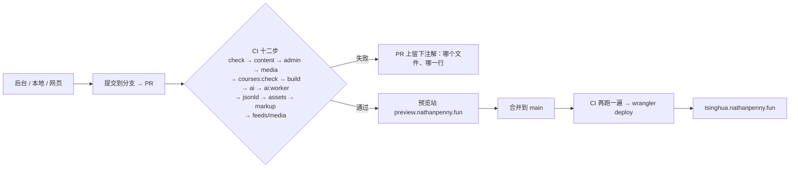
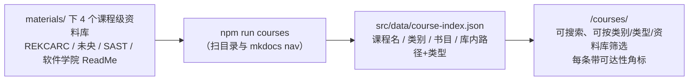

# 清华生存指南

面向清华在校学生的经验分享站 —— 不是官方材料，是一群学长学姐把踩过的坑、绕过的路写下来。

**线上** <https://tsinghua.nathanpenny.fun>　｜　**仓库** <https://github.com/nathanpenny520/TsinghuaSurvive>　｜　**最后更新** 2026-10-03

> **本文回答**：我想做 X，该改哪里、跑哪条命令。
> **不回答**：部署与排障 → [HANDOVER.md](./HANDOVER.md)｜内容还缺什么 → [OUTLINE.md](./OUTLINE.md)｜为什么这么设计 → [REFERENCE-NOTES.md](./REFERENCE-NOTES.md)｜后台方案的决策记录 → [CONTENT-EDITING-PLAN.md](./CONTENT-EDITING-PLAN.md)
>
> 下面所有命令都在仓库根目录（`Tsinghua-guide/`）里跑。

---

## 一、30 秒上手

| 我会 | 走哪条路 | 代价 |
| --- | --- | --- |
| **用浏览器** | 站内后台 <https://tsinghua.nathanpenny.fun/admin/>，改文字 / 拖图 / 嵌视频，保存自动开 PR | 登录那一下要能打开 `github.com`（开一次代理），之后全在校园网内完成 |
| **会 Git** | `npm install && npm run dev` → 改 `src/content/docs/` → push | 装一次 Node 20+ |
| **只想给素材** | 提 [Issue](https://github.com/nathanpenny520/TsinghuaSurvive/issues/new/choose) | 同样要能打开 `github.com` |
| **改代码 / 批量改** | 见下一节的三张表 | — |

推送到 `main` 会**自动构建部署**，不需要手动做任何部署动作。

> ⚠️ **校园网里 `github.com` 网页端时通时不通**（2026-09-30 超时、2026-10-03 复测 200 / 1.6–2.2 s）。
> `git clone` / `git push`（SSH）、`api.github.com`、站内后台读写**都通**；只有「点开网页」和 OAuth 授权页需要代理。
> 结论要带日期，别当永久事实。站点上的「编辑此页 / 纠错」指向 `github.com`，校内点开可能超时 —— **链接没写错**。

---

## 二、我要改 X → 改哪里

### 1. 写内容

| 我想…… | 改哪里 | 怎么做 |
| --- | --- | --- |
| **写一篇新经验帖** | `src/content/docs/<分类>/` 新建 `.md` | 复制 [`_template.md`](./src/content/docs/_template.md)；**文件名用英文小写加连字符**（中文网址在微信里会变成一长串 `%E5%AD%A6…`），中文标题写在 `title` |
| **改一篇已有文章** | 对应 `.md` / `.mdx` | 后台改（推荐）→ 本地改后 push → 网页端点「编辑此页」（需代理） |
| **插图 / 嵌视频** | 同上（后台媒体库） | 图片拖进去自动压成 WebP 传到 R2（**不进 Git**）；视频写 `::bilibili[BV号]` 或 `::video[地址]`，各占一行 |
| **加一篇骨架（结构就位、事实留空）** | `src/content/docs/<分类>/` | `status: draft` + `banner` 写明「未核实」，**不要填 `reviewedAt`** |
| **标一篇内容过期** | frontmatter | `status: outdated`（红色警告）或更新 `reviewedAt`（超过 6 个月自动橙色提醒） |
| **加一个新分类** | `astro.config.mjs` 的 `sidebar` | 建目录 → `sidebar` 加一项 `{ autogenerate: { directory: '目录名' } }` |
| **调侧边栏顺序** | 文章的 `sidebar.order` | 数字小的在前；**同目录内不要重复**，否则内容检查报错 |
| **改站点标题 / 描述 / 联系方式** | `astro.config.mjs` | 顶部有 `SITE`、`REPO` 等常量 |
| **改分享卡片图** | `scripts/generate-og.mjs` 顶部文案 | 改完跑 `npm run og`，生成 4 张（全站 + 课程 / 技能 / 链接），**记得一起提交** |
| **改「多久算过期」** | `content-policy.json` | 改 `staleAfterMonths`；站点看门狗与 CI 检查读同一份 |

### 2. 链接与数据

| 我想…… | 改哪里 | 怎么做 |
| --- | --- | --- |
| **加一个校内网址** | `src/data/links.ts` | 加一条记录，带 `reach` 可达性与 `origin` 来源。**网址活着是机器测的，入口有没有写错只有人能判断**：`reviewedAt` 记日期、`verifiedBy` 记 `'human'`（人工点开）或 `'auto'`（脚本比对标题），两个都填才显示「已核对」 |
| **加一份可下载资料** | `src/data/resources.ts` | `url` 填网盘链接、`code` 填提取码；**文件本体不要进仓库**，只放外链 |
| **加一个第三方工具** | `src/data/tools.ts` | `status`（活跃 / 不活跃 / 已停止 / 未核实）+ `access`（公网 / 校园网 / 需代理 / 未实测）。**状态栏抄上游项目页**，别凭印象写「活跃」——那一个字会被读成「可以放心用」 |
| **加一门课 / 一个资料库** | `scripts/build-course-index.mjs` | 资料库目录变了就 `npm run courses` 重新生成并提交 `course-index.json` |
| **改站内互动工具** | `src/components/` 的 `Checklist` / `CreditPlanner` / `SelectionWorkbench` | 数据只存浏览器 localStorage，**不上传**（站上唯一的后端是 AI 问答的 `/api/*`，与这些工具无关）。用 JS 二次渲染的组件**必须用 `is:global` 样式 + 前缀**，否则样式静默失效（见 HANDOVER §4） |
| **课程书目 / 课程↔技能映射** | 自动派生 | `/courses/books/` 与技能页映射表都从 `course-index.json` 读，不用手写 |

### 3. 站内问答与首页

| 我想…… | 改哪里 | 怎么做 |
| --- | --- | --- |
| **换 AI 模型 / 改限额** | `src/data/ai.config.yml` | 后台「站点配置 → AI 问答」也能直接改。默认用 Workers AI（免费额度，不需要 Key）；改用第三方要先在 `/admin/ai/` 填 Key |
| **临时试第三方模型** | `/admin/ai/` | 选预设、填 Key、保存——运行时覆盖**立即生效，不用重新部署**。口令是 Worker Secret `ADMIN_TOKEN` |
| **改首页的入口卡片** | `src/content/docs/index.mdx` | 首屏是「三张处境大卡」+「按板块找」六组；信任条的数字是实时算的，不用手改 |
| **改问答页的说明文字** | `src/content/docs/ask.mdx` | 正文里的 `<AskBox />` 是问答组件本身，**别删掉 import 那一行**（删了不报错，只是问答框消失） |
| **调检索/提示词** | `src/worker/retrieval.js`、`ai-tokenize.mjs` | 改完**必须跑 `npm run check:ai`**：里面固化了 19 个真实提问的期望排序与拒答行为 |

### 4. 检查与运维

| 我想…… | 跑什么 | 说明 |
| --- | --- | --- |
| **提 PR 前自查** | `npm run verify` | 一条命令跑完类型 + 内容 + 后台 + 媒体 + 构建 + 结构化数据 + 资源 + 订阅 + 产物比对 |
| **看还欠着什么** | `npm run check:content` | 输出「债务总账」；当前快照见 [OUTLINE.md](./OUTLINE.md) |
| **测网址还活着吗** | `npm run check:links` | 写 `src/data/link-status.json`。**校园网里跑要标测点**：`LINK_CHECK_NETWORK='清华校园网（无线，DNS 166.111.8.28）'` |
| **核对入口还是干那件事吗** | `npm run verify:links` → 人工 `npm run review:links` | 脚本抓页面比对标题；人工核对清单是离线 HTML，导出后 `review:links:apply` 写回日期 |
| **回滚线上发布** | `npx wrangler versions list` → `npx wrangler rollback <ID>` | 版本 ID 从列表里取 |

---

## 三、命令速查

| 分组 | 命令 | 什么时候用 |
| --- | --- | --- |
| **日常开发** | `npm run dev` ｜ `npm run build` ｜ `npm run preview` ｜ `npm run check` | 本地写内容；`check` 是 `astro check` 类型检查 |
| **最全自查** | `npm run verify` | **提 PR 前跑这个**（等于 `check:all` + 构建 + 四项产物校验） |
| **内容检查** | `npm run check:content` ｜ `check:content:strict` | `strict` 连债务警告也当错误（发布前用） |
| **AI 问答** | `npm run check:ai` ｜ `check:ai:worker` | 索引体积 / 覆盖度 / 锚点 + 19 个真实提问的排序自测；后者直接跑 Worker 入口（闸门、鉴权、流式、fail-closed，43 项） |
| **后台与媒体** | `npm run check:admin` ｜ `check:media` ｜ `check:media:dist` ｜ `check:markup` | 字段漏声明、视频语法糖、产物与源码容器数是否一致、`**加粗**` 有没有被原样印到页面上 |
| **课程索引** | `npm run courses` ｜ `courses:check` | 前者扫本地资料库（`materials/`，取不到回落 `reference/`）重新生成，后者只校验（CI 用） |
| **链接** | `check:links` ｜ `verify:links [-- --apply]` ｜ `review:links [-- --open]` ｜ `review:links:apply -- <文件> [--write]` | 实测 → 语义核对 → 人工核对 |
| **本地自检** | `npm run check:e2e -- --base http://localhost:4321` ｜ `npm run measure:perf -- --base http://127.0.0.1:4322` | 无头 Chrome；**`--base` 写 `localhost`**，`astro preview` 在 macOS 上只绑 IPv6 回环 |
| **后台与云资源** | `admin:vendor` ｜ `auth:dry` ｜ `auth:deploy` ｜ `r2:setup [-- --check]` | 后台编辑器兜底、OAuth 中转、R2 桶 |
| **部署** | `npm run deploy` ｜ `deploy:dry` | 平时不用跑：推 `main` 会自动部署 |

> 💡 **受限环境里的两个重定向**（`EPERM ... ~/.npm`、`EPERM ... .wrangler/logs`）：
> `export npm_config_cache="$PWD/.npm-cache" WRANGLER_LOG_PATH="$PWD/.wrangler-logs"`；
> `wrangler login` 还会往用户目录写令牌，可用 `XDG_CONFIG_HOME="$PWD/.wrangler-config"` 一起重定向（已被 `.gitignore` 忽略）。

---

## 四、目录结构

```
Tsinghua-guide/
├─ astro.config.mjs        站点配置：标题、侧边栏、SEO、视频语法糖处理器
├─ wrangler.jsonc          正式站（静态资源 + /api/* 问答接口）｜ wrangler.preview.jsonc 预览站
├─ content-policy.json     ★ 时效阈值（看门狗与检查脚本共用，避免两边漂移）
├─ src/
│  ├─ content.config.ts    ★ 内容模型（frontmatter 校验规则）
│  ├─ content/docs/        ★ 全部文章，一个文件一页（start / freshman / academics / courses / research / campus / mindset / skills / publicity / guides）
│  ├─ pages/               自定义路由：stages、tags、courses（索引 + 书目）、changelog、contributors、rss.xml
│  ├─ components/          ★ Banner（时效看门狗）、Head（JSON-LD）、LinkGrid、ToolDirectory、CourseExplorer、Checklist、CreditPlanner、SelectionWorkbench…
│  ├─ data/                ★ 手改的数据：links.ts、resources.ts、tools.ts、archives.ts；脚本产物：link-status.json、course-index.json
│  ├─ worker/              ★ 唯一的后端：/api/ask（检索+生成+流式）、/api/ai-config、/api/admin/*
│  ├─ utils/               media-embed.mjs（`::bilibili` / `::video`）、card-text.ts（`**加粗**` → `<strong>`）、ai-tokenize.mjs（构建期与运行时共用的分词）
│  └─ styles/custom.css    清华紫主题 + 中文排版
├─ scripts/                检查与生成脚本（见上一节；每个脚本头部都写了「为什么存在」）
├─ public/admin/           ★ 站内后台（Sveltia CMS，纯静态；`config.yml` 是公开配置，不放任何密钥）
│  └─ ai/                  ★ 第三方 API Key 的填写页（密钥不进 git，加密后存 Durable Object）
├─ materials/              ⚠️ 本地资料库：6 个公开资料库整理后的分类版本（约 13 GB，已删各库 .git），**已在 .gitignore 里，不进仓库**
├─ reference/              ⚠️ 整理前的旧位置（现已清空；脚本仍认它作兜底）
├─ auth-worker/            OAuth 中转（独立 Worker，不随主站 CI 部署）
└─ 文档：HANDOVER / OUTLINE / REFERENCE-NOTES / CONTENT-EDITING-PLAN（见文末地图）
                             AI 问答与首页改版的细节都在 HANDOVER 第 10、11 节
```

日常写作只需要碰 `src/content/docs/`，加链接只碰 `src/data/`。

---

## 五、一次改动是怎么上线的



| CI 步骤 | 拦什么（都是「错了不会报错、只会静默失效」的东西） |
| --- | --- |
| `check` | 类型错误 |
| `check:content` | 站内死链、中文文件名、`reviewedAt` 写在未来、同目录 `sidebar.order` 冲突、`links.ts` 重名或非法网址、资料有提取码却没链接、课程索引引用了未定义的资料库 |
| `check:admin` | 后台配置漏字段（漏一个字段，作者保存一次就丢一个字段）、OAuth 三处地址漂移、R2 占位符 |
| `check:media` | 视频语法糖写错、外链图床、空 alt |
| `courses:check` | `course-index.json` 与 `materials/`（或旧的 `reference/`）里的资料库不一致（两处都没有时自动跳过） |
| `build` | frontmatter 字段错误（报错会指出文件名） |
| `check:ai` | AI 索引体积超标（冷启动会吃掉免费档的 CPU 预算）、有页面漏进索引、引用锚点在页面里不存在、19 个真实提问的排序退步或该拒答的没拒 |
| `check:ai:worker` | 闸门顺序（先限流后校验、都不消耗额度）、问题过长过短、无关提问不去问模型、流式分帧、后台鉴权、密钥不以明文落盘、Turnstile 六种 fail-closed 分支 |
| `check:jsonld` | JSON-LD 语法、同页重复 `@type`、面包屑 position 不连续、署名是占位符 |
| `check:assets` | 分享卡片尺寸不是 1200×630、文件为空、页面引用的图不存在 |
| `check:markup` | `**加粗**` 紧贴全角标点（`**「图库」**`）导致标记不生效、星号被原样印在页面上；banner 里写 Markdown 加粗；卡片文案漏调 `descHtml()` |
| `check:feeds` / `check:media:dist` | sitemap 指向不存在的页面、RSS 缺字段、robots 把整站屏蔽；产物里的视频容器与源码对不上 |

> ✅ 错误级检测都做过**注入测试**验证会真的触发，不是写着好看。
> 💡 来自 fork 的 PR **没有预览**、也拿不到 Secrets —— 有意的安全取舍（工作流用 `pull_request`，不用 `pull_request_target`）。

---

## 六、课程资料索引是怎么来的

142 门课、185 条资料、52 门带书目 —— **不是人肉抄的，是扫出来的**（数据见 `src/data/course-index.json`）。



四个刻意的设计：

- **`materials/` 不进仓库**：6 个库整理后合计约 13 GB（大量 PDF，2026-10-05 实测；已删掉共约 11.3 GB 的 `.git`，24 GB → 13 GB），只在本地扫描用；扫描结果才提交，CI 与别人的机器都不需要它们。分类、来源与许可见 `materials/README.md`（该目录不进仓库，只在本地存在）。
- **本站不镜像任何文件**：索引里存「资料库 + 库内路径」，链接指向原库 —— 规避体积与版权，又给出「哪里有材料」的确定答案。
- **课程名会归一化**：上游目录里带老师姓名/昵称的（`面向对象程序设计基础-刘知远老师`）合并回课程名，规则在 `scripts/build-course-index.mjs` 的 `NAME_OVERRIDES`。
- **可达性优先**：校内 GitLab 镜像排在 GitHub 前面（原因见下一节）。

资料库换了目录结构就跑一次 `npm run courses`，然后提交 `course-index.json`。

---

## 七、链接为什么会变「打不开」

每条链接的可信度分三层，页面上分三个角标显示，**别混成一个「可信 / 不可信」**：

| 层 | 谁产生 | 能证明什么 |
| --- | --- | --- |
| **实测** | `npm run check:links` → `link-status.json` | 网址能打开（HTTP < 400）。**只证明域名活着** |
| **脚本核对** | `npm run verify:links -- --apply`（`verifiedBy: 'auto'`） | 抓页面比对标题与关键词，确认地址还指向那个服务（看不到登录后的内容） |
| **人工核对** | 人（`reviewedBy: 'human'` + `reviewedAt`） | 有人真的点开用过 —— **只有这一层能确认入口没写错、功能还在** |

> ⚠️ **先看清测点：在校园网里测「校外能不能开」是测不出来的。** 本机就在清华校园网内（无线 `183.173.x`、DNS `166.111.8.28`）：
> `getaddrinfo ENOTFOUND`（NXDOMAIN）说明**域名真的没了**，不要解释成「校外打不开」——上一轮就因此把上游两个死链误记成「等校内确认」；
> 校内 200 ≠ 校外能开。跑之前用 `LINK_CHECK_NETWORK='清华校园网（…）'` 标注测点，标注会写进 `link-status.json`。

当前状态（2026-10-03）：**60 条 / 60 条可访问**，59 条脚本核对 + 1 条人工核对（四六级报名，SPA + 反爬，脚本永远拿不到佐证）。

---

## 八、内容红线

投稿与审稿都必须遵守，完整说明见站内《免责声明与内容边界》：

| ❌ 不写 | 为什么 |
| --- | --- |
| 内部系统的数据、截图、账号，或绕过权限的方法 | 会让人踩纪律，也伤害提供系统的人 |
| 对具体老师的指名评价 | 样本偏差大、时效性差、容易变成人身评价 |
| 他人隐私（学号、成绩、联系方式、名单） | 不可撤回 |
| 违反校规的做法 | 同第一条 |
| 付费内容导流 | 与「帮忙」的定位冲突 |

**不确定就标「待核对」，不要编一个看起来合理的数字** —— 这是本站最重要的一条规矩。

---

## 九、文档地图与排版约定

| 文档 | 回答什么 | 不回答什么 |
| --- | --- | --- |
| [README.md](./README.md)（本文） | 我想做 X 改哪里、跑哪条命令 | 运维细节、内容缺口、设计史 |
| [HANDOVER.md](./HANDOVER.md) | 接手运维：资源 ID、部署、后台、故障排查、性能基线 | 日常写作 |
| [OUTLINE.md](./OUTLINE.md) | 内容路线图、每篇缺什么、债务总账 | 怎么做、为什么 |
| [REFERENCE-NOTES.md](./REFERENCE-NOTES.md) | 参考项目借鉴了什么、没借鉴什么、为什么 | 操作步骤 |
| [CONTENT-EDITING-PLAN.md](./CONTENT-EDITING-PLAN.md) | 站内后台方案的决策记录（已落地） | 后台的使用与部署（在 HANDOVER §9） |

给后来写文档的人（本仓库根目录的 `.md` 统一遵守）：

1. 开头六行内交代：一句话定位 + **本文回答 / 不回答（去哪）** + 最后更新日期。
2. 固定状态符号：✅ 已完成 ｜ 🟡 有框架、事实待核实 ｜ ⬜ 未做 ｜ 🕒 会过期 ｜ ⚠️ 坑 ｜ 💡 技巧。
3. **能用表格就不用列表，能用列表就不用段落**；表格首列加粗，列数保持一致。
4. 呼出块用 `> ✅ **…**` / `> ⚠️ **…**`，**不要用 `:::tip`** —— 这些文件不在站点里，GitHub 不渲染容器语法。
5. 长历史 / 证据放进 `<details><summary>` 折叠块；重复内容只留一处，其余写「见 X 文档 §Y」。
6. **数字必须带实测日期**；不确定就写「待核对」，不写「大约」。
7. 中英文之间不加空格；命令、路径、字段名一律用反引号。

---

## 许可

内容采用 **CC BY-NC-SA 4.0**。学校官方文件版权归学校所有，本站只做链接引用。
